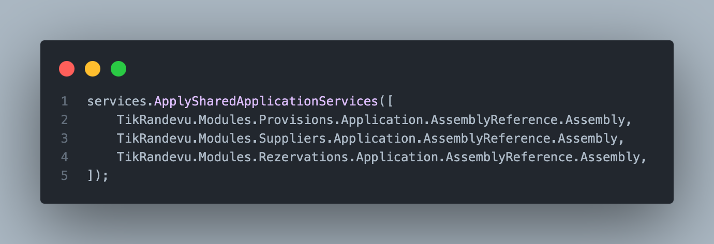
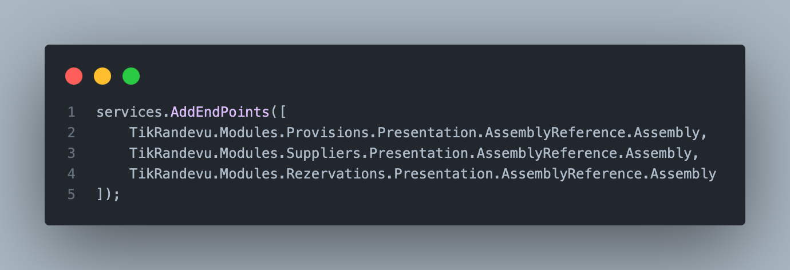
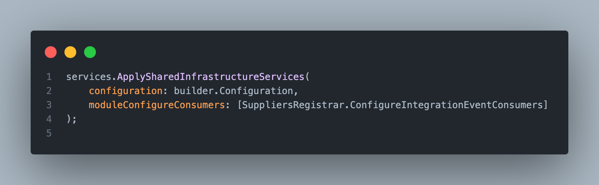
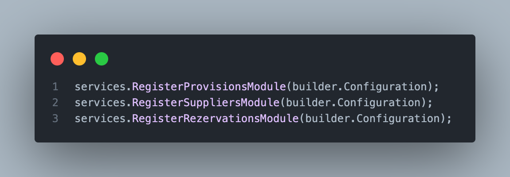
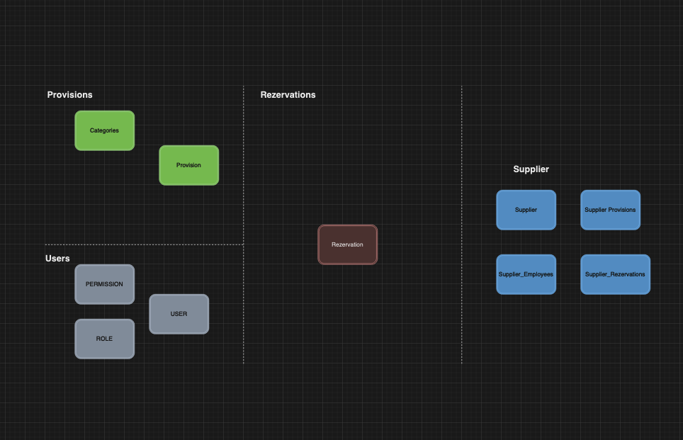
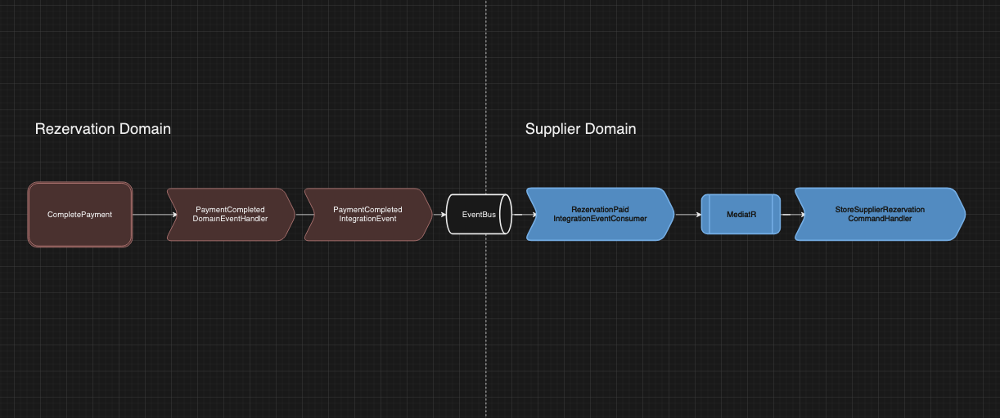
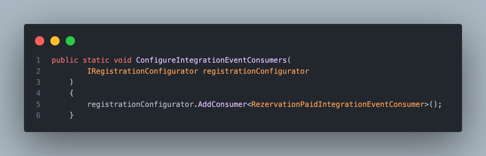

### Modül oluşturma ve Kayıt Süreci

Program.cs dosyasını inceleyecek olursak

- Shared Application Ayarlarini kayıt eden bir extension method

- Endpointleri Kayıt eden bir extension method

- Shared Infrastructure Ayalarini kayıt eden bir extension method

- Modul ayarlarini kayıt eden extension methodlar

göreceksin. Bu methodları teker teker incelediğinde ne yaptıklarını ve bir şeyler değişmesi gerekirse ne yapacağını hızlıca kavrarsın diye düşünüyorum. Sadece presentation için yazdığım method eğer routeGroupBuilder kullanılırsa refactor gerektirebilir. MapEndPoints methodu programcs yerine module registrar'larda çağırılması gerekir diye düşünüyorum.

Küçük bir not auth kısmını pushlamıyorum, admin tarafina da bir tur auth projesi kurdugun icin ortaligi karistirabilir. Onun yerine ortak bir cozum bulman bence daha temiz olacak diye dusundum. Auth olayinda bir bok yok aslinda sadece kullanacagimiz auth provider a gore service biraz degisiyor.

### PublicApi'lar hakkinda

Projede akisi anlatabilmem icin,

Useri cikardigima gore, 3 adet bounded context kullandim bunlar
- Provisions(hizmetler)
- Suppliers
- Rezervations

Uygulamada, supplier bir ekranda daha once ön tanımlı yapılmış provisions arasından seçim yaparak SupplierProvisions olusturuyor. Bu sekilde fiyat gibi değeleri kendine özel bir şekilde oluşturabiliyor. Ayrıca SupplierRezervations olacak onları integrationEventler ile olusturacağız. 

Ancak Rezervation olustururken Kullanicinin isteğinde
 - Dükkan idsi
 - Kullanıcı idsi
 - SupplierProvision idsi ve
 - Tarih (konumuz dışı)
 gönderilmesi gerek.

 CreateRezervationCommandHandler'da görebileceğin gibi, publicApi interfaceleri kullanarak bu dükkan var mı yok mu gibi sorgular yaptım. Farklı şeyler de yapılabilir, atiyorum integration event yerine bu interface benzeri kullanilarak SupplierRezervationCreate islemi yapilabilirdi. Ama senkron bir haberlesme olacagi ve domainleri ic ice sokacagi için tercih etmedim acikcasi.

 Ama zaten diğer api kullanımları ile iç içe girmedi mi,girdiler. Ama sen data duplication yapmak istemiyon o yuzden gotune girsin bu bilgiler.

 ### Integration Event
 
 Son tatava.

 Kullanıcı bir rezervasyon yaptıgında ilk etapta odemesı yapılmamış şekilde kayıt oluyor. Burada rezervasyon domainindeyiz halen. 

 Daha sonra kapora işlemi yapıldığında (CompletePaymentCommandHandler), bu arada bunu niye put yapmisim hic bir fikrim yok aq, bir domain event ateşliyorum. Bu ateşlenen PaymentCompletedDomainEvent bu rezervasyon var mı kontrolü yaptıkran sonra PaymentCompletedIntegrationEvent publish edecek.

 

 Daha sonra Suppliers domaini ile asenkron haberleşip diyeceğiz ki supplierRezervation oluştur. RezervationPaidIntegrationEventConsumer bu eventi yakalayıp consume edecek ve ayynı bir commandhandler gibi çalışıp bir StoreRezervationCommand sendleyip işlemi tamamlayacak.

 > [!Warning]
 > Kankum consumer yazdiktan sonra kayit etmeyi unutma.

 Modül kayıt ettiğin extension methodlarına (ModuleName.Infrastructure altında) şu şekil bir method yazıp consumerlarını teker teker kayıt etmen gerek.
 

 simdilik bu kadars. Berbat bir dokumantasyon farkindayim ama yapacak bir sey yok icinden cikamazsan siktiret kodu oku anlarsin zaten amk akilli adamsin Tuncelilisin bir kere hadi 25 gun rahat uyu.
 

